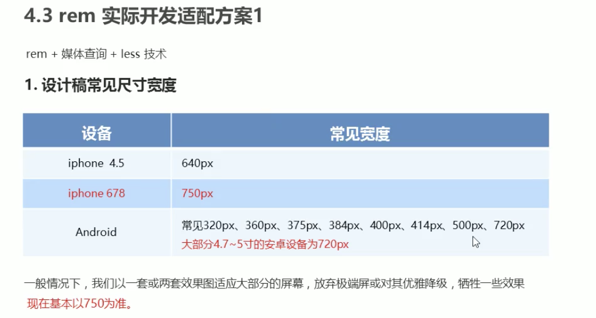

移动端rem适配方案的目的说白了就是：针对不同的屏幕大小，元素大小也同比例发生改变（要点：**元素大小随屏幕大小改变**&&**元素改变同比例**）

# rem基础

* `em`是针对自身的`font-size`大小决定的：`1em = 1* 自身(font-size)`，但是`font-size`一般是继承父元素的，所以经常会说`1em = 1 * 父元素(font-size)`
* `rem`是针对页面的`html`元素的`font-size`大小：`1rem = 1 * html(font-size) `，因为一个页面只有一个`html`元素，所以如果所有元素大小都用`rem`为单位，并且根据屏幕大小动态改变`html`元素的`font-size`，就能实现所有元素根据屏幕大小的等比例缩放。

# 媒体查询（css3新语法）

说白了就是根据不同的屏幕尺寸设置不同的样式：

~~~css
@media screen and (max-width: 800px) { // 解释：查询屏幕设备，当屏幕大小小于800px时下面的样式生效
  body {
    background-color: pink;
  }
}
~~~

## 案例

~~~css
@media screen and (max-width: 539px) {
  ...样式
}
@media screen and (min-width: 540px) and (max-width: 969px) { // 利用css层叠性可简写为：@media screen and (min-width: 540px) {
  ...样式
}
@media screen and (min-width: 970px) {
  ...样式
}
~~~

## 语法

## rem + 媒体查询

媒体查询查询屏幕大小动态更新html的font-size大小，然后页面里的所有元素大小使用rem单位。

## 引入资源

所谓引入资源就是针对不同的屏幕尺寸调用不同的css文件

~~~html
<!DOCTYPE html>
<html lang="en">
<head>
    <meta charset="UTF-8">
    <meta http-equiv="X-UA-Compatible" content="IE=edge">
    <meta name="viewport" content="width=device-width, initial-scale=1.0">
    <title>Document</title>
    
    <!-- 建议媒体查询从小到大书写,这样可以只写min-width -->
    <link rel="stylesheet" href="./first.css" media="screen and (min-width: 320px)">
    <link rel="stylesheet" href="./second.css" media="screen and (min-width: 640px)">
</head>
<body>
    ...
</body>
</html>
~~~

# less基础

css的弊端：就比如说没有计算能力，我们想知道88px是多少rem，还得拿着计算器算88除font-size算出来之后写，而不能写：`width: 88 / font-size;`(这么个意思)

## less简介

## 安装less

## less变量

### 案例

~~~less
@color: pink;
@font14: 14px;
body {
  background-color: @color;
}
div {
  color: @color
  font-size: @font14;
}
~~~

## less编译

## less嵌套

## less运算

# rem适配方案（重点）

## 相关技术栈

## 基于rem的适配方案一

说白了就是我们针对宽度进行适配，针对一份设计稿，比如750px宽度，我们平均分成若干份，比如分成15份，一份就是50px，我们就设置html的font-size为50px。其实这里html的font-size就是一个全局的参照标准了，而不是说去使用它单纯作为一个字体大小样式。

然后我们所有的大小长度单位都用设计稿的实际px的值除50rem表示。

## 案例（针对方案一）

`min-width`是针对最小的机型的屏幕宽度。其实说白了，配置完媒体查询的css文件，剩下的css样式与平时开发的唯一区别就是所有宽高等长度单位都改成`rem`单位即可。比如：

1. 设计稿是`750px`宽的，我们把屏幕宽度分成15份，其一份大小为html的`font-size`大小——50（只是一个选择，一个决定而已）
2. less文件中，先定义`@baseFont: 50`

3. 设计稿上一个盒子`width: 70px;`

4. 开发时：`@baseFont: 50;`，`width: 70rem / @baseFont;`

## 基于rem的适配方案二

不想学了，原理应该就是这个flexible.js以一种标准（比如手机屏幕划分10等份为html的font-size）自动帮我们给出了媒体查询的css文件，原理还是rem适配原理，用到再说吧。