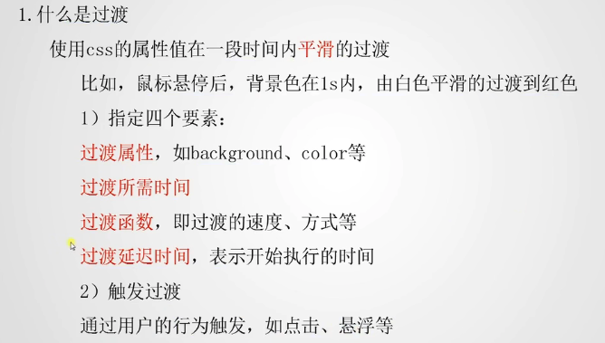
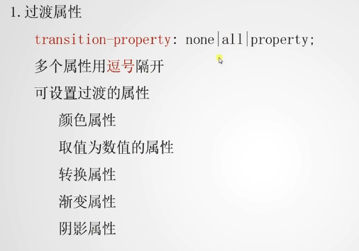
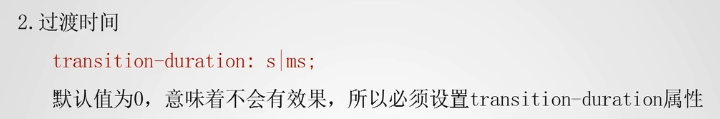
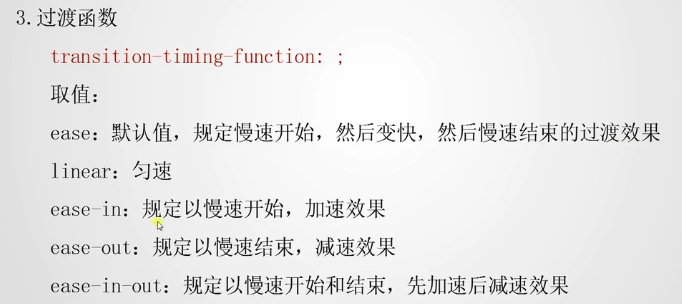
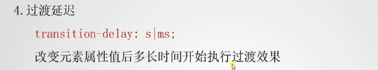
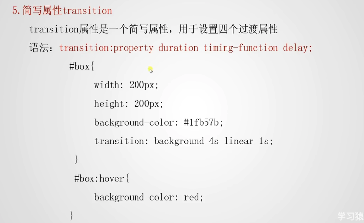

# 浏览器私有前缀

css3完全向后（向前就是向未来；向后就是向过去）兼容：不必改变现有的设计，浏览器永远支持css2

因为制定HTML和CSS标准的组织W3C动作是很慢的，一个属性已经足够成熟了之后（但还未发布为w3c标准），浏览器商不愿意等太久就会在自己的浏览器中加入此属性的支持，但是呢，此时毕竟是某个浏览器商自己决定的支持，并不是w3c的规范，所以呢，浏览器商自行支持某个属性时，不能直接支持这个属性的原名属性，而是在属性前面加上一个前缀，然后这家浏览器商对这个加了自家前缀的属性进行支持：

~~~css
div {
  text-stroke:1px #f00; // 这个属性（文字描边）谷歌是支持的，但是属于一个测试阶段，也就是我们上面所说的谷歌提前于w3c进行了此属性的支持；所以这样写是无效的
  -webkit-text-stroke: 1px #f00; // 有效代码（谷歌从功能上支持text-stroke属性，但实际支持的属性是-webkit-text-stroke）
}
~~~

不同的浏览器商，也就是对应着不同的浏览器内核，对应着一个或者多个浏览器：

* Gecko内核：前缀为`-moz-`，火狐浏览器
* Webkit内核：也叫谷歌内核，前缀为`-webkit-`，chrome浏览器最先开发使用，safari，以及国内的360极速、猎豹等
* Trident内核：也称为IE内核，前缀为`-ms-`
* Presto内核：前缀为`-o-`，只有opera采用

平时开发时对于一个测试阶段的css属性，正确的书写方式是：

把各浏览器内核支持的带前缀的属性依次全写完，然后最后书写没有前缀的标准属性（我猜应该是方便属性正式加入标准之后进行css样式覆盖吧）

# 过渡属性

## 概述：

## 过渡属性

## 过渡时间

## 过渡函数

## 过渡延迟

## 简写属性transition

* 可以同时设置这四个值，并且**没有次序要求**。

* 只有一个要求：

  * 如果写两个时间 前边的默认是持续时间 后边的是默认时间。

  * 如果写一个时间，这个时间指的是持续时间。

# animation动画

其实动画属性使用起来与transition很相似

简写属性：`animation`，若干个子属性，其中一个是使用的动画，类似于transition中指定的过渡属性，然后还有动画持续时间，动画延迟时间，动画重复次数以及动画函数

子属性也没有次序要求，只是第一个时间一定是动画持续时间

**使用动画之前需要先用@keyframes定义：**

~~~css
/*
    定义关键帧动画：
*/
@keyframes myAnimation {
    50% {
        margin-left: -300px;
    }
}
/*
    给swiper-item-container使用动画（让它水平移动）
*/
#swiper-item-container {
    an
~~~

具体案例见：./关键帧动画.html