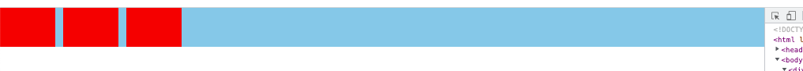

# 实用文章

1. CSS3 linear-gradient线性渐变实现虚线等简单实用图形（内含制作图形的工具网站）：https://www.zhangxinxu.com/study/201710/css3-linear-gradient-dashed-generate.html

# Linear-gradient()函数

## 简介：

这是一个用来在css中生成图片的函数，一般作为border-image属性的属性值（函数返回值为图片，所以理论上用到图片的地方就能用这个函数）

## 生成函数的特点：

可以任意设计颜色渐变

## 举例：

~~~css
/* 从上到下，蓝色渐变到红色 */
linear-gradient(blue, red);
 
/* 渐变轴为45度，从蓝色渐变到红色 */
linear-gradient(45deg, blue, red);
 
/* 从右下到左上、从蓝色渐变到红色 */
linear-gradient(to left top, blue, red);
 
/* 从下到上，从蓝色开始渐变、到高度40%位置是绿色渐变开始、最后以红色结束 */
linear-gradient(0deg, blue, green 40%, red);
~~~

## 用法概括：

* ```
  background-image: linear-gradient(direction, color-stop1, color-stop2, ...);
  ```

* 第一个参数为方向参数，我们指定颜色渐变的方向，可能的取值为`to left\to bottom\to bottom right`等四个正方向的搭配，还可以为任意的灵活的角度，（**这个方向就类似于一个钟表的指针指向的方向，12点钟为0deg，也就是360deg，顺时针方向deg增加，3点钟为90deg。**）如37deg：


​	

* 除了第一个参数之外后面的参数都是颜色参数，可以是`red`、`transparent`或者`rgba()`，第一个颜色就是渐变开始位置的颜色，然后最后一个颜色就是渐变结束位置的颜色

* 颜色后面可以跟空格加一个`px`或者`%`，表示在整个渐变长度的某个位置是什么颜色，如：

  ~~~
  /* 从下到上，从蓝色开始渐变、到高度40%位置是绿色渐变开始、最后以红色结束 */
  linear-gradient(0deg, blue, green 40%, red);
  
  background: linear-gradient(to right, #643cd3, #643cd3 9px, transparent 9px, transparent);
  ~~~


# background-image

背景图片，**这是可以叠加的**，background-image和background-size之间用逗号隔开。

也就是说，我们可以写：

~~~css
.btn-plus {
    background-image: linear-gradient(to top, currentColor, currentColor), linear-gradient(to top, currentColor, currentColor);
    background-size: 10px 2px, 2px 10px;
}
~~~

来实现一个➕

# background-size

## 简介：

指定背景图片的大小（形状），此属性必须放到backgroun-imge属性后面才会生效

## 取值：

* cover：图片缩放至正好把元素全盖上，保持图片宽高比（cover字面意思）

* contain：图片缩放至正好被元素包含，保持图片宽高比（contain字面意思）

* ..px ..%：一般为两个值，指背景的宽高

  * length：设置背景图像的高度高度和宽度。第一个值设置宽度，第二个值设置高度。如果只设置一个值，则第二个值会被设置为auto

  * percentage:以父元素的百分比来设置背景图像的宽度和高度。第一个值设置宽度，第二个值设置高度。如果只设置一个值，则第二个值会被设置为auto

# background-origin

## 简介：

三个取值为content-box、padding-box和border-box，定义背景图片左上角与元素的哪一部分重合

## 举例：

```
background-origin: border-box
background-origin: padding-box
background-origin: content-box

background-origin: inherit
```


# column-gap

适用于`多列布局`、`flex布局`、`网格布局`，多列和网格我也不会，也没用到，记录一下搭配`flex`布局使用，`flex`布局中搭配使用`column-gap`可以更灵活的进行布局。

`column-gap`是加给`flex`容器（父元素）的，不考虑多行等特殊场景，就常用的`flex`容器内一行元素，`column-gap`相当于给元素之间添加间隙，并且这个间隙不是子元素的`margin`等属性导致的，它是属于父元素的一个样式。注意，只作用于**元素之间**：

~~~html
<style>
  body {
    padding: 0;
    margin: 0;
  }
</style>
<body>
  <div class="container">
    <div class="item"></div>
    <div class="item"></div>
    <div class="item"></div>
  </div>
  <style>
    .container {
      display: flex;
      column-gap: 10px; // 设置子元素横向间隙为10px
      height: 50px;
      background-color: skyblue;
    }
    .container .item {
      height: 100%;
      width: 70px;
      background-color: red;
    }
  </style>
</body>
~~~

效果：



第一个块和第二个块之间，第二个块和第三个块之间多了10px的间隙（第一个块与左边界没有出现间隙，第三个块后面也没有什么空间的占用）

如果给`item`添加上`margin: 0 10px`，效果如下：


也就是说，`margin`和`column-gap`的效果不冲突，两者的作用效果可以叠加。（毕竟`column-gap`是属于父元素的样式，`margin`是属于元素本身的样式）