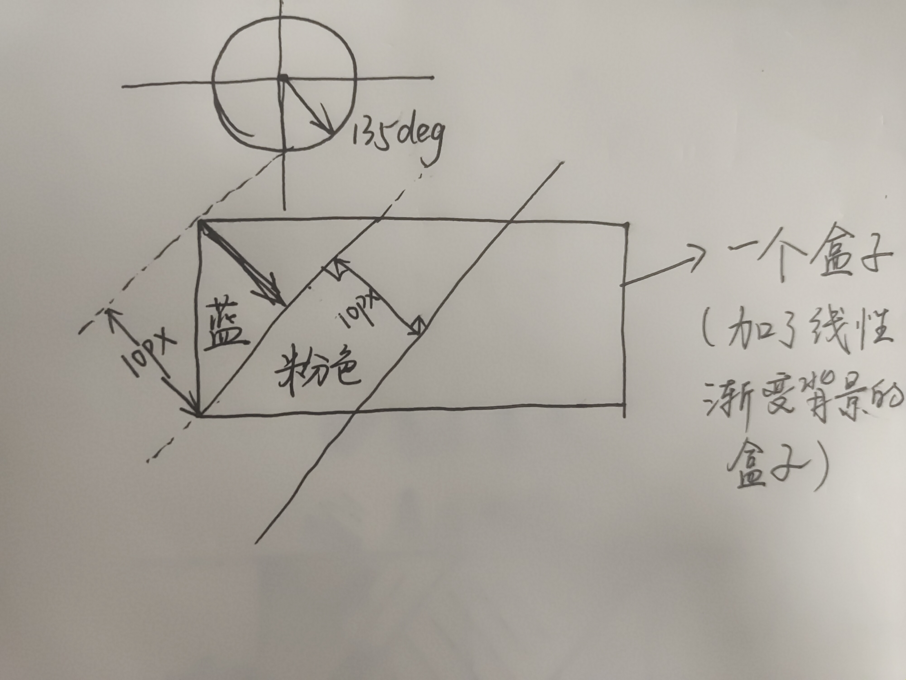

# 背景

感觉如下的这种斑马线进度条也算是非常常见的需求场景了，我以一个刚刚经历了从不会到会的人客观评价一下这个需求：“会者不难，难者不会”。

自己胡乱琢磨了老一阵子没啥产出，然后接着是和梦杰姐（我mentor）一个多小时的思维碰撞（一起胡乱琢磨😂），此时我已经悟了，最终结果就是我用了五分钟，手撕了如下的进度条。

实现这个需求，重点在于对几个background相关属性的清晰理解，我下面详细分析了代码实现的逻辑。适宜人群：

1. 有业务需要的同志
2. 想深入学习一下css背景相关属性的同志

![[video-to-gif output image]](image/斑马线进度条.gif)

# 代码如下

~~~html
<!DOCTYPE html>
<html lang="en">
<head>
    <meta charset="UTF-8">
    <meta http-equiv="X-UA-Compatible" content="IE=edge">
    <meta name="viewport" content="width=device-width, initial-scale=1.0">
    <title>Document</title>
    
</head>
<body>
    

        

        

    

</body>
</html>
~~~

# 实现解析

## 布局

布局很简单，就是进度条的一般套路，外层一个盒子代表整个进度条区域，内部一个盒子表示当前的进度。

## 斑马线静态实现

实现类似于斑马线的效果，就一个核心css内置函数的使用：`background: repeating-linear-gradient(135deg, blue, blue 10px, pink 10px, pink 20px);`，解释一下，`linear-gradient`以及这里的`repeating-linear-gradient`作为一个css内置函数，其作用可以理解为返回一个图片，具体这个图片函数名就已经形容清楚了，一个线性渐变的图片，第一个参数确定整个渐变的方向，然后剩下自由定义若干个参数，参数的格式为`<颜色 位置(可选)>`，**表示在渐变方向上，到某个位置时生成的背景图是什么颜色。**

具体举个例子，就说上面的`background: repeating-linear-gradient(135deg, blue, blue 10px, pink 10px, pink 20px);`第一个参数表示整个线性渐变的方向是`135deg`（12点为0deg，顺时针增加），这个方向我就不多说了。然后第一个`blue`省略了位置参数，默认为渐变的起点，也就是0px，表示渐变方向的起点为蓝色，`blue 10px`表示顺着渐变方向走到10px位置时颜色变为`blue`，没错，从`blue`变为`blue`就是没变，因为我们要构造斑马线，不需要颜色渐变效果，然后接着`pink 10px`表示接着变成粉色，走到20px时也保持粉色，最后因为是`repeating`，所以不断重复这个变化过程直至覆盖整个盒子的背景区域。加上这个属性之后就会发现内部的盒子已经出现倾斜的斑马线效果了。

## 斑马线动效

首先我们明确一些关于`linear-gradient`所生成背景图的理解：渐变是从盒子的左上角开始的，整个图片的大小可以理解为无限大，之所以我们看到了长条型的斑马线是因为添加背景图的盒子就是长条型的，我们只看到了与盒子重合部分的图片，之所以树立这个观点是为了引出动效的核心：

通过添加动画来修改背景图的`background-position`来产生动态效果，可以先看动画：

~~~css
@keyframes progressAnimation {
    from{
        background-position: 0 0; 
    }
    to{
        background-position: 28px 0;
    }
}
~~~

先不管28px怎么来的，思路就是让背景图片从左向右平移，基于上面的观点——背景图是无限大的，所以背景图向右移动的过程中左侧并不会空白，而是一直有斑马线条纹出现，从而达到动态效果。

## 数学计算具体的css属性值

我们需要明确当下存在的问题，把上面的成品源代码的`background-size: 28px 14px;`注释掉，效果如下：

![[video-to-gif output image]](image/注释掉bgSize.gif)

仔细分析一下不难解释上面的问题：进度条的最左边（出现问题的位置），其实是我们的盒子内部生成的 背景图 与 左侧滑进来的、一开始没看到的背景图 没有很好的衔接上导致的。

所以这里我们要解决的问题就是让盒子内部的背景图与左侧一开始未出现在视野区域的左侧背景图无缝衔接，很简单，设置`background-size`来限制背景图的大小，这里提一嘴`repeating-linear-gradient`与`background-size`的关系，`repeating-linear-gradient`生成的线性图不断重复最终的目标是覆盖整个`background-size`的区域，未设置`background-size`时默认背景图区域就是整个盒子的区域，现在我们设置了`background-size`之所以还会把整个盒子覆盖上斑马条纹，是因为图片的`background-repeat`默认值为`repeat`，然后再不断重复整个背景图整体导致的。

**为什么要设置`background-size`的宽度为`28px`就能保证生成的背景图之间无缝衔接，28px的值和斑马线的宽度（10px），渐变角度（135度）都是有关系的**，具体的计算看下图（非常简单的初中三角函数）：

设置`background-size`的宽度为28px后就完成背景图片的无缝衔接了，至于背景图的高度，只要是比我们进度条盒子的高度高就行（明白了上面的线性渐变函数的行为这个不难理解的，因为线性渐变函数生成背景图片后相当于拿着盒子的大小去裁剪这个背景图，只要是背景图比盒子高就不会出问题）

# 总结

先说上面的具体的例子，我们是基于斑马线每种颜色的宽度为10px的基准计算的，从这个10px出发，我们计算出了`background-size`宽度为28px即可让左右的背景图无缝衔接，然后动画自然就好写了，初态就是让背景图的位置处于盒子的左上角，然后终态就向右移动一个`background-size`宽度的距离即可，动画一开始左侧就出现新的背景图了，但因为不同背景图的斑马线都衔接在一起了，所以视觉无感。

这里计算的出发点是渐变角度为45%，斑马线的宽度为10px。由上面的分析可想而知，应对各种设计需求——任意倾斜角度，或者以进度条宽度为计算的出发点，我们只要把握住上面的思想——让各个背景图无缝衔接，问题都可以迎刃而解。